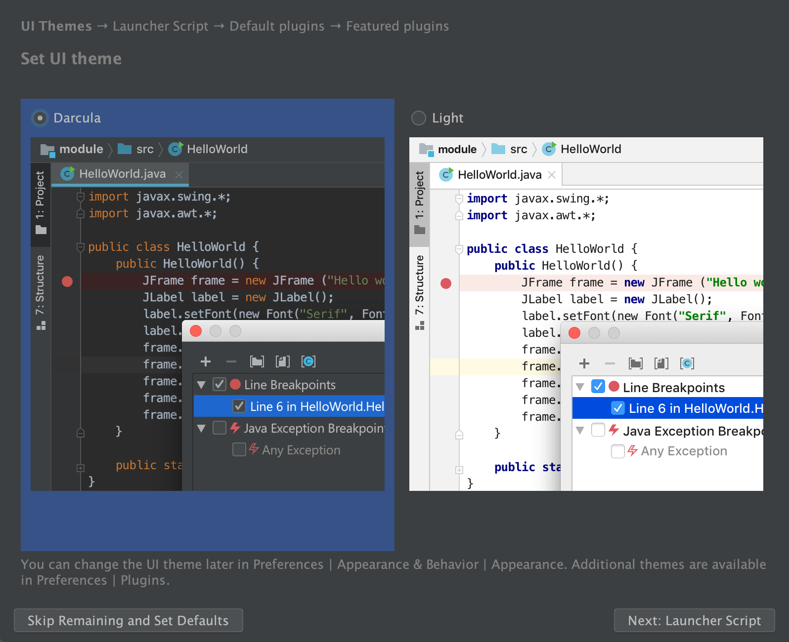
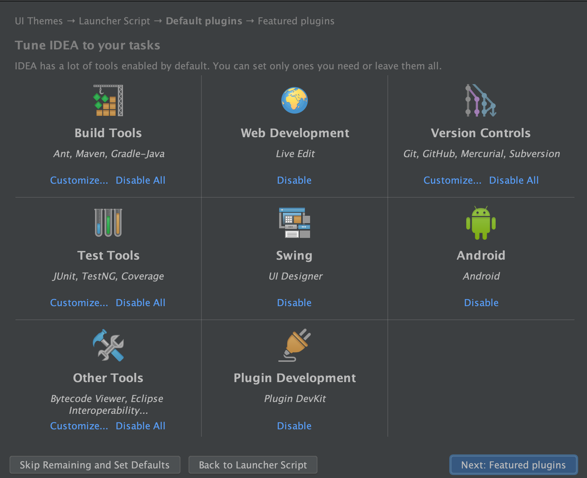

id: codelab-02_setup

# 環境のセットアップ
## 環境のセットアップ

この章ではIntelliJ IDEAとPlayのセットアップを行います。  
既に完了されている方はスキップしていただいて問題ありません。  

## 注意事項

本ハンズオンは現在(2020年02月)時点で最新である、Play2.8を利用してハンズオンを進めていきます。  

また本ハンズオンは以下を前提として構築されています。  

1. マシンにsbtがインストールされている
2. Mac OSのパソコンを利用している


前提となっている環境と差異がある方は各々読みかえていただいたり、適宜セットアップを行ってください。  

[sbt インストール方法 Windowsの場合](https://www.scala-sbt.org/1.x/docs/ja/Installing-sbt-on-Windows.html)  
[sbt インストール方法 Macの場合](https://www.scala-sbt.org/1.x/docs/ja/Installing-sbt-on-Mac.html)  
[sbt インストール方法 Linuxの場合](https://www.scala-sbt.org/1.x/docs/ja/Installing-sbt-on-Linux.html)

## 推奨環境

 ハンズオンが作成されている環境がsbt1.3系を利用しているため、これを推奨します。  

- 1.3系のsbtが導入されている

## Playの導入

早速ですがPlayの導入を行っていきます。  
sbtのコマンドからPlayのシードプロジェクトを作成してみましょう。  

任意のプロジェクトディレクトリを作成して、以下のコマンドを実行してください。  
あくまで例になりますが、以下にMacでの作業をイメージしてコマンドを記載していきます。  

```sh
# 参照: https://www.playframework.com/documentation/2.8.x/NewApplication
$ cd ~/Documents/workspace/
$ sbt new playframework/play-scala-seed.g8
# ... 省略

This template generates a Play Scala project

name [play-scala-seed]: play-handson
organization [com.example]: com.example
```

name部分でプロジェクト名を指定しています。  
organizationは個人のドメインをお持ちの方は、その逆順で記載しても良いです。  
今回はサンプルのためデフォルトのままの `com.example`を指定しています。  

これでコマンドを実行したフォルダ以下に`name`で指定したプロジェクト名のフォルダが作成されます。  

```sh
$ tree  -L 2 | pbcopy
.
└── play-handson
    ├── app
    ├── build.sbt
    ├── conf
    ├── project
    ├── public
    ├── target
    └── test
```

`sbt new`が完了したら、ローカルでサーバを起動して動作を確認してみましょう。  

```sh
$ cd {your_project_root}
$ sbt run

# .... 以下の表示がでたらサーバが起動しています。
# --- (Running the application, auto-reloading is enabled) ---
# 
# [info] p.c.s.AkkaHttpServer - Listening for HTTP on /0:0:0:0:0:0:0:0:9000
# 
# (Server started, use Enter to stop and go back to the console...)
```

サーバが起動したら、ブラウザからアクセスをしてみましょう。  
[http://localhost:9000](http://localhost:9000)

以下の画面が表示されていればOKです。  


導入自体はこれで完了になります。  
簡単で良いですね。  

## 統合開発環境(IntelliJ IDEA)のセットアップ

今回はIntelliJ IDEA 無償版のセットアップの手順を記載していきます。  

Visual Studio Code + Metalsについては、いつの日にか手順を作ってみたいと思っております。  
今回は作っておりません。  

### IDEAのダウンロード

[こちらのサイト](https://www.jetbrains.com/ja-jp/idea/)からIDEAのダウンロードリンクを押下してください。  


各々OSに合わせたダウンロードページへ遷移します。(たぶん)  
ダウンロードページに遷移したら、以下のボタンから無償版のIDEAをダウンロードします。  


IDEAをインストールできたら、IDEAを起動して次のステップへ進んでください。  

### IDEAへのプロジェクトの取り込み

まず、IDEAを起動したら`Open`からプロジェクトを開いていきましょう。  


ファインダーから選択するときには、対象のプロジェクトを反転させてから`Open`で問題ありません。  


次にIDEAのテーマを選択します。  
ここはお好みのテーマを選択してください。  



次のステップでは`shell`からIDEAを起動するためにPATHを通すか選択する画面になります。  
ここもご自身で自由に設定いただいて問題ありません。  


次は好みの設定があるようでしたら変更いただいても問題ありませんが、基本的にはそのままで大丈夫です。  



この画面では印がしていあるように、Scalaのインストールだけは必須で行ってください。  
他のものについては任意です。  


これでIDEAが起動して、プロジェクトが読み込まれます。  
またそのときに下の画像のようなポップアップが表示されたら`Import Changes`を選択しましょう。  


sbtに変更が加わったときなどに表示されます。これをしないとsbt関連の変更が適用されないのでご注意ください。  
  
`Enable Auto-Import`をすると自動で設定を更新するようになりますが、sbtの読み込みはマシンパワーを使うことがあるので私は手動が好きです。  
ただこれはお好みで選んでいただいて構いません。  

では、起動が完了したら試しに`app/controllers/HomeController.scala`のファイルを開いてみましょう。  


ソースコード上で、21行目の`Action`に`Cmd`キーを押しながらカーソルを移動してみてください。  
マウスが当たったときにカーソルが指マークに変わるとおもいます。  
そこでクリックをしてみましょう。  
Actionの実装に飛ぶことができれば設定は正常にされている状態になっています。  

うまく動作しないときはJDKのインストールとScalaの設定ができていないときがあります。  
そのときは声をかけてください。  

これでIDEAの設定は完了になります。  


[< 導入へ戻る](https://github.com/Christina-Inching-Triceps/scala-play_handson/blob/master/lesson1/documents/01_introduction.md)  
[ハンズオンへ進む >](https://github.com/Christina-Inching-Triceps/scala-play_handson/blob/master/lesson1/documents/03_handson.md)
