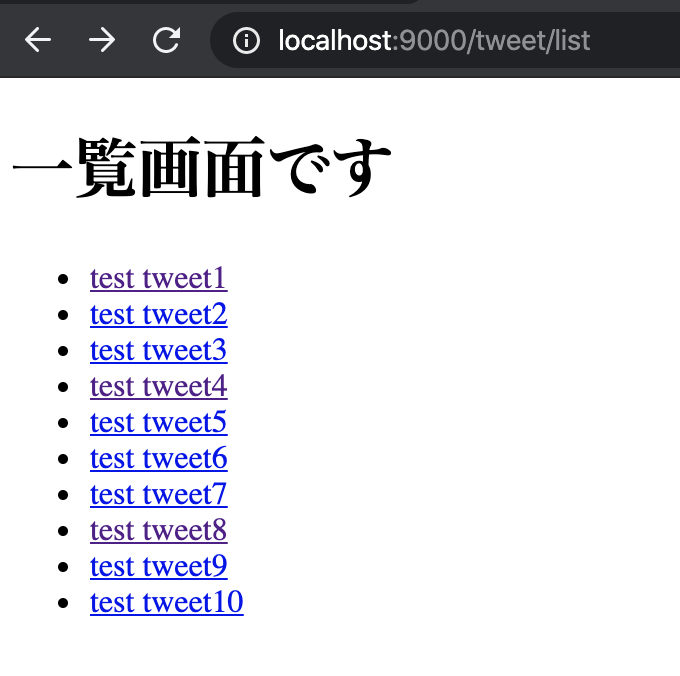
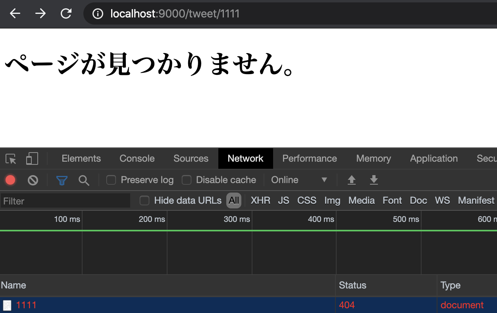
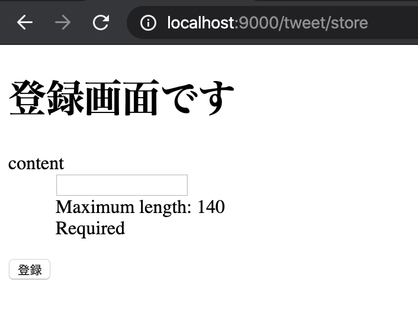
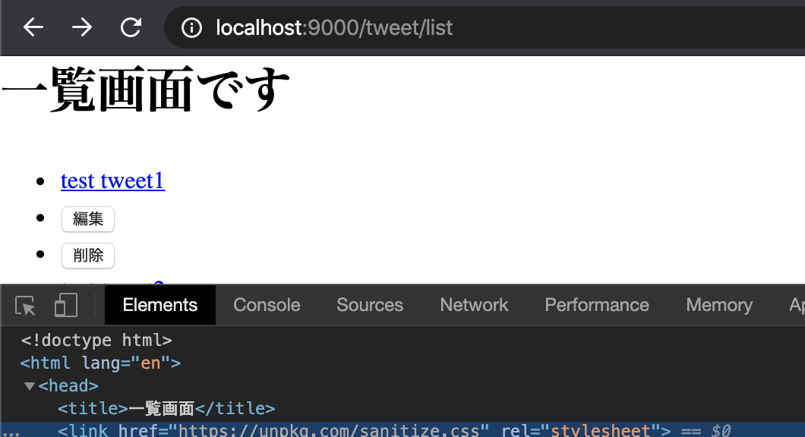

## PlayFrameworkの基本的なフォルダ構成

この章からCRUD機能の開発を進めていきます。  

開発に入る前に、Playのフォルダ構成とその中からよく利用する主なファイルについて簡単に説明します。  

```sh
.
├── app
│   ├── controllers
│   │   └─ HomeController.scala
│   └── views
│       ├── error
│       ├── index.scala.html
│       ├── main.scala.html
│       └── main.scala.html
├── build.sbt
├── conf
│   ├── application.conf
│   ├── logback.xml
│   ├── messages
│   └── routes
├── logs
│   └── application.log
├── project
│   ├── build.properties
│   └── plugins.sbt
├── public
│   ├── images
│   ├── javascripts
│   └── stylesheets
├── target
└── test
```

基本的に`scala`ファイルは`app`以下に配置していきます。  
`views`もこのapp以下に配置されていますね。   
`views`にはtwirlというscalaとhtmlの混ざったViewテンプレートを配置します。  

`conf`には設定関連が配置されています。  

`application.conf`はメインの設定ファイルで、システムから利用する設定情報などを記載します。記載された設定は`controller`にDIされたconfigインスタンスから利用できます。  
今後一番利用することになる設定ファイルです。  

`logback.xml`はログ出力フォーマットや出力条件などを設定するものでPlayで採用されている`logback`というライブラリのための設定ファイルになります。  
Play独自のものではないため、本ハンズオンでは詳細には取り扱いません。気になる方はlogbackというワードで調べてみると、細かい設定方法が確認できます。  

`messages`は多言語対応や、メッセージ管理用の設定でバリデーションメッセージなど各メッセージの管理に利用できます。  
`routes`はルーティング情報を記載するファイルです。分割して管理することなども可能です。  
システムから利用される際には、このファイルの情報がコンパイルされたClassファイルが利用されるようになっています。  

`project`以下にはsbt系の設定ファイルを切り出して配置します。  
ここで定義したものを`build.sbt`で読み込んで利用したりします。  
例えばscalafmtなどのプラグインを`plugins.sbt`に追加して利用したりします。  

`build.sbt`はプロジェクトのビルド設定ファイルです。  
ビルドするための依存ライブラリを記述したり、デプロイ設定を記載したりします。  
またsbt shellにコマンドを追加するときにも、このファイルに追加を行っていきます。  

概ねフォルダやファイル名が示す通りですが、このような構成になっています。  
開発するだけであればapp以下, routesあたりが一番よく触るファイルになると思います。  

## 一覧ページ作成

それではPlayの機能を触りながら一覧ページから作成していきましょう。  
前述の通り、今回はPlayに集中するためDBへのアクセスは行わずに機能を作成していきます。  

### ルーティング

まずはリクエストに対する処理の設定をみていきます。  
Playでは`conf/routes`のファイルでルーティングを管理しています。  
今の状態の`conf/routes`ファイルを開いてみると以下のようになっていると思います。  

`conf/routes`
```
# ... 一部抜粋
# An example controller showing a sample home page
GET     /                           controllers.HomeController.index
```

これは`GET`Methodの`/`へのリクエストに対して`controllers.HomeController.index`を設定すると言うことになります。  
この設定のおかげで、Playは`http://localhost:9000`、つまりルート(`/`)に対して`HomeController`の`index`アクションを実行するということを理解できるようになります。  

今回は一覧表示機能を作成したいので、以下のようにルーティングを設定してみましょう。  

`conf/routes`
```
GET     /tweet/list                 controllers.tweet.TweetController.list
```

今回は意図的に`tweet`というパッケージを間に挟んでいます。  
よくあるサンプルでは独自にパッケージを追加したものがほとんどなく、今後の参考のためにこのようにしています。  

次は設定したルーティングに必要なコントローラーを作成してきましょう。   

### Controllerの作成

PlayではControllerクラスでリクエストに対しての処理を受け取ります。  
Controller内にあるリクエストに対するメソッドは一般的にアクションと呼ばれます。(他のプログラミング言語、フレームワークでも同様です)  

ここでは`TweetController.scala`を作成し、その中に`list`アクションを作成していきます。  

`app/controller/tweet/TweetController.scala`
```scala
package controllers.tweet

import javax.inject.{Inject, Singleton}
import play.api.mvc.ControllerComponents
import play.api.mvc.BaseController
import play.api.mvc.Request
import play.api.mvc.AnyContent

/**
  * @SingletonでPlayFrameworkの管理下でSingletonオブジェクトとして本クラスを扱う指定をする
  * @Injectでconstructorの引数をDIする
  *   BaseControllerにはprotected の controllerComponentsが存在するため、そこに代入される。
  */
@Singleton
class TweetController @Inject()(val controllerComponents: ControllerComponents) extends BaseController {

  // BaseControllerにActionメソッドが定義されているため、Actionがコールできる
  //   このActionにcontrollerComponentsが利用されているためInject部分でDIされている
  def list() =  Action { implicit request: Request[AnyContent] =>
    // Ok()はステータスコードが200な、Resultをreturnします。
    // つまり正常系としてviews.html.tweet.listのコンテンツを返すということになります。
    Ok(views.html.tweet.list())
  }
}
```

プログラム内にコメントで各実装の説明を記載していますが、少し難しい部分も多いためよくわからない部分は慣れるまでは一旦深追いしなくても大丈夫です。  
今回覚えておきたいのは以下の部分です。  

```scala
def list() =  Action { implicit request: Request[AnyContent] =>
  Ok(views.html.tweet.list())
}
```

まず`Action { ...` の部分は言語として用意された構文ではありません。  
正確ではありませんが、イメージとしては`Action(request: Request => { block })` というメソッドの呼び出しになります。  

この`{ block }`の部分が`implicit request: Request[AnyContent] =>`以後に記載されているプログラム全体です。  
今回の場合には以下の部分がブロック内の実装になっていますね。  

```scala
Ok(views.html.tweet.list())
```

この部分はHTTPステータスコードの`200 OK`をreturnしつつ、レスポンスとして`views.html.tweet.list`の画面を返すという意味になります。  

これで`http://localhost:9000/list`のリクエストに対してのアクションを作成できました。  
一度プログラムをコンパイルしてみましょう。  
コンパイルはターミナルから、以下のコマンドを実行することで行えます。  

```shell
$ sbt compile
# sbt ~compileとするとファイル変更を検知するたびに自動ビルドされます。お好みで使い分けてください。
```

まだエラーになってしまっていますね。  
それはこのリクエストに対するレスポンスに指定している`views.html.tweet.list`のファイルが存在しないからです。  

次は一覧画面のためのhtmlを作成していきましょう。  

### 画面の作成

Playではデフォルトでは`Twirl`というテンプレートエンジンを利用して画面を作成します。  
Twirlのファイルは`views/`直下に配置されており、拡張子が`.scala.html`となっています。  
今回は`views/tweet/list.scala.html`を作成していきます。  

このフォルダ構成が先ほどの`Ok(views.html.tweet.list())`の指定とマッピングされています。  
以下のようなイメージですね。  
`views.html`   => `views/`  
`tweet.list()` => `tweet/list.scala.html`  

では、ファイルを作成して、まずは以下のように中身を実装していきましょう。  

`app/views/tweet/list.scala.html`
```html
@* これはTwirlのコメントです。
以下はview templeteでの引数を受け取る記載です。
今回は引数が不要のため @() となっています。
*@
@()

@main("一覧画面") {
  <h1>一覧画面です</h1>
}
```

@mainの部分については後ほど説明をしますので、今は「h1の表示を出すんだな」くらいの理解で問題ありません。  

ここまで出来たら、一度ページへアクセスして動作を確認してみましょう。 
以下のような画面が表示されればOKです。  
[http://localhost:9000/tweet/list](http://localhost:9000/tweet/list)  


### モデルの作成とリスト表示

単純なページ表示は行えたので、次はモデルを作成してそのモデルを一覧表示してみます。  

#### モデルの作成

今回利用するTweetモデルを作成していきます。  
モデルを配置する場所などは任意に設定できますが、今回はapp以下にmodelsフォルダを作成して進めてみます。  

`app/models/Tweet.scala`
```scala
package models

// case classについての説明は省略
// 参考: https://docs.scala-lang.org/ja/tour/case-classes.html
case class Tweet(
  id:      Option[Long],
  content: String
)
```

非常にシンプルなクラスになりました。  
`case class`についての説明は省略しますが、非常に雑に説明すると`toString`, `equals`がいい感じに実装されていたり`apply`や`unapply`メソッドなどが実装されている便利なClassです。  

#### モデルをViewへ渡す

先ほど作成したControllerを修正して、モデルをコントローラからViewへ渡してみましょう。  

`app/controllers/tweet/TweetController.scala`
```scala
def list() =  Action { implicit request: Request[AnyContent] =>
  // 1から10までのTweetクラスのインタンスを作成しています。
  // 1 to 10だとIntになってしまうので1L to 10LでLongにしています。
  val tweets: Seq[Tweet] = (1L to 10).map(i => Tweet(Some(i), s"test tweet${i.toString}"))

  // viewの引数としてtweetsを渡します。
  Ok(views.html.tweet.list(tweets))
}
```

今回はDBを利用しないので、Controller側に決め打ちでモデルのインスタンスを実装しています。  
`views.html.tweet.list()`に引数としてtweetsを渡すところまではできました。  
次はView側で引き渡されたTweetを受け取って表示をしてみます。  

#### Viewでモデルを受け取り表示

早速コードを修正していきましょう。  

`app/views/tweet/list.scala.html`
```html
@* Twirl側でもクラスを正しく認識するためにscalaファイルと同様にimportが必要です。  *@
@import models.Tweet

@*
以下はview templeteでの引数を受け取る記載です。
今回はTweetの一覧を取得するため@(tweets: Seq[Tweet]) となっています。
*@
@(tweets: Seq[Tweet])

@main("一覧画面") {
  <h1>一覧画面です</h1>
  <ul>
    @* Twirlでのfor記法です。forと(の間にスペースを入れると動かないので注意してください *1 *@
    @for(tweet <- tweets) {
    <li>@tweet.content</li>
    }
  </ul>
}
```

修正内容はプログラム上のコメントの通りになりますが、新しくimportと引数の受け取り、受け取ったインスタンの出力を追加してあります。  
Twirlの記法については[こちら](https://www.playframework.com/documentation/ja/2.3.x/ScalaTemplates)を参考にしてください。  

これで一覧表示の実装は完了です。  
ブラウザから動作を確認してみましょう。  
[http://localhost:9000/tweet/list](http://localhost:9000/tweet/list)

以下のように表示されていればOKです。  


ちなみに、以下が*1注釈にあるスペースを入れた場合のエラーです  

*1: スペースを入れると出るエラー  

## 詳細ページ作成

一覧が作成できたので、次は詳細ページを作成していきます。  
データがコンテンツくらいしかないので寂しいページにはなりますが、復習もかねて一覧ページを作成したのと同じように実装を進めていきます。  

### ルーティングの作成

詳細ページはどのデータの詳細情報を表示するか判断するための情報が必要になります。  
今回はモデルにあるIDでデータを特定するように実装を進めます。  
以下のようにroutesファイルにルーティングを追加してください。  

`conf/routes`
```
GET     /                           controllers.HomeController.index
GET     /tweet/list                 controllers.tweet.TweetController.list
# 追加
GET     /tweet/:id                  controllers.tweet.TweetController.show(id: Long)
```

`/tweet/:id`という記載がでてきました。  
ここでは`:id`箇所のデータをパラメータとして受け取っています。  
例えば`http://localhost:9000/tweet/1`のとき`TweetController`の`show`メソッドに`1`が引数として渡されます。  

またパラメータ受け取りは今回のようなURL文字列からの取得以外にも、通常通りのQueryStringからの取得も可能です。  

例えば以下のようなroutesがあったとします。  
```
GET     /tweet/detail               controllers.tweet.TweetController.show(id: Long)
```

このとき`http://localhost:9000/tweet/detail?id=1`のようなURLであれば、showに1が渡されます。  

### アクションとViewの追加

ルーティングが追加できたので、そこに紐づくアクションとViewを追加してきます。  

`app/controllers/tweet/TweetController.scala`
```scala
@Singleton
class TweetController @Inject()(val controllerComponents: ControllerComponents) extends BaseController {
  // DBのMockとして利用したいので、先ほどlistに作成したインスタンスをフィールドとして定義し直す
  val tweets: Seq[Tweet] = (1L to 10L).map(i => Tweet(Some(i), s"test tweet${i.toString}"))

  def list() =  Action { implicit request: Request[AnyContent] =>
    // フィールドに変数を移したので、ここでの変数定義を削除

    Ok(views.html.tweet.list(tweets.toSeq))
  }

  def show(id: Long) = Action { implicit request: Request[AnyContent] =>
    Ok(views.html.tweet.show(
      // tweetsの一覧からIDが一致するものを一つ取得して返す
      // getは良くない書き方なため、後のセクションで修正する
      tweets.find(_.id.get == id).get
    ))
  }
}

```

まずtweetsをフィールドとして定義し直しています。  
これはDBなしでデータを一定期間保持しておくための実装です。  

showメソッドの中でOption型を直接getしていますが、これはnullに対して安全な処理ができるメリットを捨ててしまうことになるため、後ほど修正していきます。  

`views/tweet/show.scala.html`
```html
@import models.Tweet
@(tweet: Tweet)

@main("詳細画面") {
  <h1>詳細画面です</h1>
  <div id="detail">
    <div>id: @tweet.id</div>
    <div>id: @tweet.content</div>
  </div>
}
```

TwirlについてはSeqだった引数がTweetになっているくらいの変化しかありません。  

ここまでできたら、以下のURLにアクセスして画面が正常に表示できるか確認してみましょう。  
[http://localhost:9000/tweet/1](http://localhost:9000/tweet/1)

以下のように表示されていればOKです。  


### 一覧からのリンク作成

詳細ページが完成したので、次は先きほど作成した一覧ページからリンクを通してみます。  

`views/tweet/list.scala.html`
```html
@import models.Tweet
@(tweets: Seq[Tweet])

@main("一覧画面") {
  <h1>一覧画面です</h1>
  <ul>
    @for(tweet <- tweets) {
    <li>
      @* よくウェブ上で @routes.HomeController.index のようなものをみるがこれはtwirlではデフォルトでcontrollers.routesがインポートされているためcontroller部分が省略されているだけ。*@
      <a href="@controllers.tweet.routes.TweetController.show(tweet.id.getOrElse(0))">@tweet.content</a>
    </li>
    }
  </ul>
}
```

href部分ではroutesファイルの設定から、紐づくURLを作成するようにしてあります。  
書き方は`{Controllerのパッケージ}.routes.{Controller名}`となります。
  
コメントにも記載していますが、ウェブ上で良くみる`@routes`から始まる書き方は、Playのデフォルトで`controllers.routes`がインポートされているから動作しているものです。  

ここを理解していないと独自でパッケージを切ったりしていく時に非常に苦労することになるので頭の隅に残しておきましょう。  

では、最後に動作確認です。  
[http://localhost:9000/tweet/list](http://localhost:9000/tweet/list)

以下のようにリンクが表示され、リンククリックで詳細ページが表示されたら完了です。  



### エラーページ作成

先ほど省略したエラーページの表示を行います。  
まずは実装からみてみましょう。  

`app/controllers/tweet/TweetController.scala`
```scala
def show(id: Long) = Action { implicit request: Request[AnyContent] =>
  // idが存在して、値が一致する場合にfindが成立
  tweets.find(_.id.exists(_ == id)) match {
    case Some(tweet) => Ok(views.html.tweet.show(tweet))
    // status codeを404にしつつページを返しています。
    case None        => NotFound(views.html.error.page404())
 }
}
```

この実装では元々`get`をしてしまっていた部分についても、改善するようにしています。  
tweetのidがURLから受け取ったidと一致するものを`find`しています。  
`exists`はNone.existsの場合に常に`false`になります。  

今回はデータのない場合の表示なのでstatusとして404(NotFound)を指定しています。  
Ok, NotFoundは同じクラスなので同様の使い方が可能です。  

次にNotFoundで指定してるページを作成します。  

`app/views/error/page404.scala.html`
```html
@()

@main("ページが見つかりません") {
  <h1>ページが見つかりません。</h1>
}
```

ここまでできたら動作を確認してみましょう。  
この状態で存在しないTweetを参照しようとすると以下のようになります。  
[http://localhost:9000/tweet/1111](http://localhost:9000/tweet/1111)



ステータスコードが404で、作成したページが表示されていることが確認できますね。  
エラーページを作成する方法は以上です。  

### HomeControllerから一覧へリダイレクト

ここまでできたら`/`ページへのアクセスを一覧ページリダイレクトしてみましょう。  

`app/controllers/HomeController.scala`
```scala
package controllers

import javax.inject._
import play.api._
import play.api.mvc._

@Singleton
class HomeController @Inject()(val controllerComponents: ControllerComponents) extends BaseController {

  def index() = Action { implicit request: Request[AnyContent] =>
    Redirect(tweet.routes.TweetController.list())
  }
}
```

ここでは自分自身がcontrollersパッケージにいるので、リバースルーティングはその先にあるパッケージからの記載になります。  
今回は `controllers.tweet.routes....` を呼び出したいので `tweet.routes...` で動作します。  

これでリダイレクトの設定は完了です。  
こういうところでハマりやすいのですよね。私はハマりました。  

## 登録ページの作成

次は登録機能を作成していきます。  
例によってconf, controllerと修正していきましょう。  

登録処理は今までの機能とは違い、画面からformの値を受け取るという動作があります。  
Formはよく利用する機能なので登録・更新と処理を書く中で少しずつ慣れていきましょう。  

### ルーティングの追加

`conf/routes`
```
GET     /                           controllers.HomeController.index
GET     /tweet/list                 controllers.tweet.TweetController.list
GET     /tweet/:id                  controllers.tweet.TweetController.show(id: Long)
# 下の2つを追加
GET     /tweet/store                controllers.tweet.TweetController.register
# actionがないとエラーになるので一旦コメントアウト
# POST    /tweet/store                controllers.tweet.TweetController.store
```

今回は`/tweet/store`というルーティングをget, postのそれぞれで追加しています。  
これは登録用画面の表示と、実際に登録処理を行うアクションで2つのアクションが必要になるためです。  

またルーティングは追加してみましたが、実はこのルーティングは正常に動作しません。  
理由は`/tweet/:id`の設定の方が上位に書かれているからです。  

playのルーティングは先勝ちになっているようで`/tweet/store`にアクセスしようとすると`:id`の部分に`store`が取られてしまいます。  

これを回避するには2つの方法があります。  

1. `/tweet/:id`が数値のみをとるように変更する
2. storeのルーティングを上にあげる

基本的には1の方が良いので、ここでは1の方法で修正してみます。

`conf/routes`
```
GET     /tweet/$id<[0-9]+>          controllers.tweet.TweetController.show(id: Long)
```

これで`show`のルーティングでは0-9の数字しか受け付けなくなりました。  

### 登録用画面の実装

続いてコントローラを修正していきますが、今回はアクションの追加のみではなくFormオブジェクトの設定も行なっていきます。  

#### Formの追加

まずFormオブジェクトの追加を行っていきます。  
Formオブジェクトを利用することでPOSTでの値受け取りをフレームワーク側に移譲しつつ、バリデーションなどの処理を簡単に適用することができます。  

習うよりコードを見た方が早いと思うので、早速コードをみてみましょう。  
Formはいくつかの書き方が出来るので複数の書き方を記載していますが、結論`パターン2`の書き方で実装を進めていきます。。  

```scala
// パターン2用のcase class
case class TweetFormData(content: String)

class TweetController @Inject()(val controllerComponents: ControllerComponents) extends BaseController {
  // ...省略

  // パターン1: 既存クラスを使いまわして、apply, unapplyを自前で書くパターン
  val form1: From[Tweet] = Form(
    // html formのnameがcontentのものを140文字以下の必須文字列に設定する
    mapping(
      "content" -> nonEmptyText(maxLength = 140)
    )
    // apply, unapplyを自分で書いているパターン
    ((content: String)  => Tweet(None, content))
    ((v: Tweet)         => Some(v.content))
  )

  // パターン2: Form用にcase classを作成するパターン(推奨)
  val form2: From[Tweet] = Form(
    mapping(
      "content" -> nonEmptyText(maxLength = 140)
    )(TweetFormData.apply)(TweetFormData.unapply)
  )


  // パターン3: tuple, singleを利用するパターン
  // 受けとるデータが単数なのでsingleとしていますが、複数の場合にはtuple()になります。 
  val form3 = Form(
    single(
      "content" -> nonEmptyText(maxLength = 140)
    )
  )

  // ...省略
}
```

`single`, `tuple`と`mapping`の使い分けは、Formから受け取った値をクラスにマッピングしたいときには`mapping`  
そのまま利用したいときには`single`, `tuple`を利用する、なります。  

デフォルトで利用できるバリデータは他にも`email`, `number`, `boolean`などがあります。  
Formの使い方の詳細は以下の公式ドキュメントを参照してください。  
[参照: Form submission and validation](https://www.playframework.com/documentation/2.8.x/ScalaForms)

今回利用するフォームがオブジェクトができたので、次はルーティングに対応するアクションを追加していきましょう。  

#### 画面表示用アクションの追加

まずは簡単な登録画面表示のアクションから作成していきます。  

`app/controllers/tweet/TweetController.scala`
```scala
// controllersクラスの外に記載
case class TweetFormData(content: String)

// ...省略: フィールド
val form = Form(
    // html formのnameがcontentのものを140文字以下の必須文字列に設定する
    mapping(
      "content" -> nonEmptyText(maxLength = 140)
    )(TweetFormData.apply)(TweetFormData.unapply)
  )

def register() = Action { implicit request: Request[AnyContent] =>
  Ok(views.html.tweet.store(form))
}

// コンパイルエラー回避用に何もしない登録用のstoreメソッドも作成
def store() = Action { implicit request: Request[AnyContent] =>
  NoContent
}
```

シンプルですね。  
ここで先ほど作成したformを画面へ渡しています。  

先ほどの実装ではフォームをいくつか作成していましたが、ここでは`form2`のみを残して`form`にリネームしています。  

#### viewの作成

アクションが作成できたのでViewを追加します。  
今までのViewを参考にしつつ、以下のようにファイルを作成していきましょう。  

`views/tweet/store.scala.html`
```html
@import controllers.tweet.TweetFormData
@(form: Form[TweetFormData])

@main("登録画面") {
  <h1>登録画面です</h1>
  @helper.form(action = controllers.tweet.routes.TweetController.store()) {
    @helper.inputText(form("content"))
    <input type="submit" value="登録">
  }
}
```

今回新しく`@helper`というパッケージを利用しています。  
ここにはFormを利用するためのヘルパー関数がいくつも用意されています。  
importに`@import helper._`を追加して利用するのも一般的です。  

ここまで出来たら、一度コンパイルしてみましょう。  
そうすると以下のようにエラーになると思います。  
```sh
$ sbt compile

An implicit MessagesProvider instance was not found.  Please see https://www.playframework.com/documentation/latest/ScalaForms#Passing-MessagesProvider-to-Form-Helpers
[error]     @helper.inputText(form("content"))
[error]                      ^
[error] one error found
[error] (Compile / compileIncremental) Compilation failed
[error] Total time: 0 s, completed 2020/02/24 21:37:20
```

これはinputTextが暗黙の引数としてmessagesProviderのインスタンスを必要としているために発生します。  
何をヒントに修正していけばいいのかは、エラーメッセージの中に書かれていますね。  
[Passing-MessagesProvider-to-Form-Helpers](https://www.playframework.com/documentation/latest/ScalaForms#Passing-MessagesProvider-to-Form-Helpers)

implicitが出てくると非常に難しく感じてしまいますよね。  
最初は「直接手で引数を渡すと面倒くさいから自動で渡すようにしているんだな」くらいの理解で良いと思います。  

エラー修正のため、messagesProviderをviewへ渡していきます。  

```html
@import controllers.tweet.TweetFormData
@* 以下の引数ブロックにimplicit用の引数を追加 *@
@(form: Form[TweetFormData])(implicit messageProvider: MessagesProvider)

@main("登録画面") {
  <h1>登録画面です</h1>
  @helper.form(action = controllers.tweet.routes.TweetController.store()) {
    @helper.inputText(form("content"))
    <input type="submit" value="登録">
  }
}
```

この状態でもう一度コンパイルをしてみると、どうでしょう。

```sh
$ sbt compile

An implicit MessagesProvider instance was not found.  Please see https://www.playframework.com/documentation/latest/ScalaForms#Passing-MessagesProvider-to-Form-Helpers
[error]     Ok(views.html.tweet.store(form))
[error]                              ^
[error] one error found
[error] (Compile / compileIncremental) Compilation failed

```

先ほどと同様のエラーですが、エラーが出る箇所がコントローラまで上ってきています。  
というわけで、次はコントローラを修正してあげる必要があります。  
修正方法はエラーメッセージの中にある`Please see`のリンク先を見ればわかるようになっていますね。  

  
[https://www.playframework.com/documentation/latest/ScalaForms#Passing-MessagesProvider-to-Form-Helpers](https://www.playframework.com/documentation/latest/ScalaForms#Passing-MessagesProvider-to-Form-Helpers)


こちらを参考にコントローラを直してみましょう。  

`app/controllers/tweet/TweetController.scala`
```scala
class TweetController @Inject()(val controllerComponents: ControllerComponents) 
extends BaseController with I18nSupport {
```

`with`句で新しくI18nSupportをmixinしています。  
Scalaでは2つ目以降の継承, mixinはwithで記載します。  
これでコンパイルをするとエラーが解決されているのが確認できるはずです。  

```sh
$ sbt compile
[success] Total time: 0 s, completed 2020/02/24 22:09:40
```

ここまで出来たら、一度登録画面を表示してみましょう。  
[http://localhost:9000/tweet/store](http://localhost:9000/tweet/store)

以下のように画面が表示されていればOKです。  



ちょっと不格好ですが、この辺りは後ほど修正していきます。  
少し長丁場になっていますが、次は登録処理を作成していきましょう。  

### 登録処理の実装

登録処理の実装は今までのアクションと比べて少し複雑になります。  
具体的には画面から受け取ったフォームデータの利用や、入力ミスがあった場合の元画面でのエラー表示などがあります。  

#### tweetsのSeqをmutable化

tweetのインスタンスデータを保持しつつ、可変な状態にするために`tweets`フィールドを可変配列に置き換えていきます。  
Scalaではimmutableなオブジェクトやリストを利用するのが基本のため、あくまでサンプルのための実装になります。  

`app/controllers/tweet/TweetController.scala`
```scala
class TweetController @Inject()(val controllerComponents: ControllerComponents) extends BaseController with I18nSupport {
  // DBのMockとして利用したいので、mutableなクラスのフィールドとして定義し直す
  val tweets = scala.collection.mutable.ArrayBuffer((1L to 10L).map(i => Tweet(Some(i), s"test tweet${i.toString}")): _*)

// ...省略


  def list() =  Action { implicit request: Request[AnyContent] =>
    // 型エラー回避のためtweets.toSeqでimmutableSeqに変換してから画面に渡す
    Ok(views.html.tweet.list(tweets.toSeq))
  }
```

これでtweetsをデータ保持しつつ可変な配列に変更できました。  
通常Scalaではimmutableを基本にしたプログラミングをするので、具体的な処理の内容は理解しなくても問題ありません。  
気になったら各々調べてみてください。  

#### 登録用アクションの実装

tweetsを可変Seqに変更できたので、改めて登録処理を実装していきます。  
作成が完了した処理をみてみましょう。  

```scala
def store() = Action { implicit request: Request[AnyContent] =>
  // foldでデータ受け取りの成功、失敗を分岐しつつ処理が行える
  form.bindFromRequest().fold(
    // 処理が失敗した場合に呼び出される関数
    // 処理失敗の例: バリデーションエラー
    (formWithErrors: Form[TweetFormData]) => {
      BadRequest(views.html.tweet.store(formWithErrors))
    },

    // 処理が成功した場合に呼び出される関数
    (tweetFormData: TweetFormData) => {
      // 登録処理としてSeqに画面から受け取ったコンテンツを持つTweetを追加
      tweets += Tweet(Some(tweets.size + 1L), tweetFormData.content)
      // 登録が完了したら一覧画面へリダイレクトする
      Redirect("/tweet/list")
      // 以下のような書き方も可能です。基本的にはtwirl側と同じです
      // 自分自身がcontrollers.tweetパッケージに属しているのでcontrollers.tweetの部分が省略されています。
      // Redirect(routes.TweetController.list())
    }
  )
}
```

`bindFromRequest`はimplicitでrequestを受け取っています。  
そのため、リクエスト情報からformで設定したマッピング情報を元に入力チェックと値変換を行うことができるんですね。  
そして、その処理の成否によって`fold`で処理を分岐しているという動きです。  

失敗時には400のBadRequestとして受け取ったフォームデータにエラーメッセージを追加して元の画面に戻しています。  
成功時には受け取ったデータから新しいTweetを作成して一覧画面へリダイレクトしています。  

ちなみに、`fold()()`で失敗を左、成功を右とするような動きは`Option`や`Either`にも似たようなものがあります。  
成功は`That's Right`的に右にする慣習があります。  

`Seq`の`fold`はまた雰囲気の違う動きになるのですが、この辺の違いは圏論でいうところの`Catamorphism`というものを理解するとわかるようになるみたいです。  

私はこの辺りは良くわからないので省略しますが、このfoldの使い方は割とよくあるみたいなので気が向いた際に学習してみたり、頭の隅に置いておくとコードが読みやすくなるかもしれません。  

では、処理が書けたの実際に登録画面から登録してみてください。
[http://localhost:9000/tweet/store](http://localhost:9000/tweet/store)

登録してみるとどのようになるでしょうか。  
以下のような画面になっていないでしょうか。  


これだけだとよくわからないですよね。  
こういうときはコンソールに出ているメッセージを確認してみましょう。  

```sh
[warn] p.filters.CSRF - [CSRF] Check failed because no or invalid token found in body for /tweet/store
[warn] p.filters.CSRF - [CSRF] Check failed with NoTokenInBody for /tweet/store
```

サーバのログにこのようなメッセージが出ていました。  
CSRFのチェックが正常に行われずにエラーになっているようです。  

実はPlayではPOST, PUTなどはデフォルトでCSRFチェックがかかるようになっています。  
そのため画面からトークンを渡しておらずエラーになるということですね。  
詳細は[こちら](https://www.playframework.com/documentation/2.8.x/ScalaCsrf)に記載されています。  

では、公式サイトの情報に習って修正を行っていきましょう。  

```html
@import controllers.tweet.TweetFormData
@* CSRFトークンの生成ヘルパーで、requestHeaderを必要としているのでこちらも暗黙パラメートして渡しています。 *@
@(form: Form[TweetFormData])(implicit messagesProvider: MessagesProvider, requestHeader: RequestHeader)

@main("登録画面") {
  <h1>登録画面です</h1>
  @helper.form(action = controllers.tweet.routes.TweetController.store()) {
    @* CSRFトークンの生成ヘルパーを呼び出している。これでいい感じにトークンが用意されます。 *@
    @helper.CSRF.formField
    @helper.inputText(form("content"))
    <input type="submit" value="登録">
  }
}
```

今回implicitの引数を一つ追加しています。  
implicitと書かれていませんが、implicitにした引数のブロックは全部implicitになります。それ以外は定義できません。  
以下のようなことをするとコンパイルエラーになります。  
`(messagesProvider: MessagesProvider, implicit requestHeader: RequestHeader)`

もう一つこのrequestHeaderを利用して、CSRFトークンを生成するヘルパーを呼び出しています。  
実際に実装の定義を見ていると以下のようになっており、implicitで引数を求めていますね。  
`def formField(implicit request: RequestHeader): Html`

それでは今度こそ動作をみてみましょう。  
[http://localhost:9000/tweet/store](http://localhost:9000/tweet/store)

##### バリデーションエラーの場合


##### 登録成功の場合


それぞれこのようになっていれば完了です。  

### 表示・テンプレートの調整

基本的にはこれまでの部分で登録処理は完成ですが、英語でメッセージが出ていたり、フォームヒントが出ていることが見栄え的に良くないので、その部分の対応の仕方を記載します。  

#### 日本語メッセージの表示

まずエラーメッセージやフォームへの注釈表示を日本語に対応してみます。  

多言語化対応はi18nの機能で実装されており、それぞれの言語に合わせたメッセージを設定することで霧狩ることができます。  

今回は例として日本語への対応を行ってみます。  

##### application.confの設定

まずはどの言語に対応するかを`application.conf`へ設定していきます。  

`conf/application.conf`
```
# application.confでは#の行がコメントになります。  

# i18n設定
# conf/{play.i18n.path}messagesとなる
play.i18n.path         = "messages/"

# HTTP HeaderのAccept-Languageの値と比較を行い許可する対象を設定する
# messages.{langs}のファイルが読み込み対象になる
play.i18n.langs        = ["ja", "en-US"]
```

今回設定しているのは2つ。  
1つ目がメッセージファイルの配置場所です。  
デフォルトでは`conf/`直下がファイルの配置場所になっていますが、各言語のファイルが並ぶと見辛いので場所を変更しています。  
通常日本語くらいしか利用しないとは思いますが、フォルダ位置を変更したくなる人もいるとおもうため、そこでハマってしまう人を減らす意図も有ります。  

2つ目が対応するAccept-Languageの値の指定です。  
今回は日本語とアメリカ英語を対象にしています。  

このようにするとAccept-Languageヘッダに`ja`、`en-US`の文字があったときに優先度に合わせてplayが自動的に読み込みに行く`message`ファイルを切り替えてくれます。  

以下の部分にあるものです。  


このとき対象のファイルは`messages.{lang}`というフォーマットになります。  
今回だと`messages.ja`と`messages.en-US`になります。  

またどの設定にも当てはまらない場合にはデフォルトファイルとして`messages`ファイルを読みに行くようになっています。  

一点注意が必要で、全てのクライアントが適切にAccept-Languageを指定してくれるとは限らないということです。  
どのように管理するかは自由ですが、上記忘れずにおかないと人によってはメッセージが違う、という不具合に繋がってしまいます。

##### messagesファイルの設定

application.confの設定が終わったので、messagesファイルを作成します。  
今回はen-USは省略して日本語とデフォルトだけ作成してみます。  

まずはファイルを設定する前の状態で、表示をしてみましょう。  
[http://localhost:9000/tweet/store](http://localhost:9000/tweet/store)  
入力なしで登録しようとすると以下のように表示されると思います。  


この未設定状態のメッセージが設定ファイルに記載するときのkey名になっているので、覚えておいてください。  
動きが確認できたら、改めてmessagesファイルの設定を行っていきましょう。  

`conf/messages/message`
`conf/messages/message.ja`
```
# https://www.playframework.com/documentation/latest/ScalaI18N
# 上記リンクに用意されているメッセージ一覧や利用方法が記載されています。
error.invalid=入力が不正です
error.required=入力は必須です
error.maxLength={0}文字以内で入力してください

# 未設定状態では、このkey名が画面に表示されるのでそれをみて設定をすれば良いです。
constraint.required=*
constraint.maxLength=最大{0}文字まで
```

これで今回必要な分の設定は完了です。  
ブラウザからメッセージを確認してみてください。  
[http://localhost:9000/tweet/store](http://localhost:9000/tweet/store)  


これでmessagesの設定は完了です。  

ちなみにこの設定ファイルでのkey名ですが、これはリンク先のページもに一覧で記載されていますので、目を通していただけるとどんなものがあるのかわかると思います。  

#### 入力のヒント表示制御

続いてFormHelperの制御を行っていきます。  
今の実装だとconstraintsが全て表示されてしまって見辛いので、これを非表示にしてみます。  
設定できる値は以下を参照ください。  
[公式ドキュメント](https://www.playframework.com/documentation/ja/2.4.x/ScalaCustomFieldConstructors)

`app/views/tweet/store.scala.html`
```html
@import controllers.tweet.TweetFormData
@(form: Form[TweetFormData])(implicit messagesProvider: MessagesProvider, requestHeader: RequestHeader)

@main("登録画面") {
  <h1>登録画面です</h1>
  @helper.form(action = controllers.tweet.routes.TweetController.store()) {
    @helper.CSRF.formField
    @* contentはフリー入力系の項目なのでtextareaに変更しています。*@
    @helper.textarea(form("content"),
      @* 通常のhtml属性を設定。'を先頭につけて -> で値を渡します。 *@
      'rows -> 7, 'cols -> 40,
      @* helperに渡す属性です。 'をつけて->で値を渡すのは同様です。 *@
      '_label -> "ツイート" ,'_showConstraints -> false
    )
    <input type="submit" value="登録">
  }
}
```

Tweetのcontentはinput textにするには文字数が多すぎるのでtextareに変更しました。  
またtextareaのサイズ調整にrows, colsのhtmlのtextareタグにある属性を利用しています。  
基本的にform helperへの値渡しは(symbol, value)の形式で渡します。  


'_label, '_showConstraintsはhelper側で用意されている属性です。  
今回はこの2つを設定してみました。  
では、この状態で動きを見てみましょう。  


このようにhtmlの属性と、helperの動きを制御できました。  

登録を画面を通しての基本的はtwirl, formの利用方法はこれで完了です。  
次はおさらいも兼ねて変更画面を作成してきましょう。  

ところで、現在symbolは非推奨になってきているはずなのですが、今後play(twirl?)はどうするのでしょうね？  

## 更新ページの作成

更新ページの作成は今まで作ってきたものを参考に進めていけば、基本的には問題なく作成できます。  
早速それぞれ必要なファイルを作成してみましょう。  

### 実装

`conf/routes`
```
GET     /tweet/$id<[0-9]+>/edit     controllers.tweet.TweetController.edit(id: Long)
POST    /tweet/$id<[0-9]+>/update   controllers.tweet.TweetController.update(id: Long)
```

`app/controllers/tweet/TweetController.scala`
```scala
  /**
    * 編集画面を開く
    */
  def edit(id: Long) = Action { implicit request: Request[AnyContent] =>
    tweets.find(_.id.exists(_ == id)) match {
      case Some(tweet) =>
        Ok(views.html.tweet.edit(
          // データを識別するためのidを渡す
          id,
          // fillでformに値を詰める
          form.fill(TweetFormData(tweet.content))
        ))
      case None        =>
        NotFound(views.html.error.page404())
    }
  }

  /**
    * 対象のツイートを更新する
    */
  def update(id: Long) = Action { implicit request: Request[AnyContent] =>
    form.bindFromRequest().fold(
      (formWithErrors: Form[TweetFormData]) => {
        BadRequest(views.html.tweet.edit(id, formWithErrors))
      },
      (data: TweetFormData) => {
        tweets.find(_.id.exists(_ == id)) match {
          case Some(tweet) =>
            // indexは0からのため-1
            tweets.update(id.toInt - 1, tweet.copy(content = data.content))
            Redirect(routes.TweetController.list())
          case None        =>
            NotFound(views.html.error.page404())
        }
      }
      )
  }
```

今回は編集画面で利用するformにデフォルト値を埋め込んでいます。  
その処理をしているのが`form.fill`です。  
このメソッドにformとマッピングされている型のインスタンスを渡すことでformへ値を詰めることができます。  


`app/views/tweet/list.scala.html`
```html
@import models.Tweet
@(tweets: Seq[Tweet])

@main("一覧画面") {
  <h1>一覧画面です</h1>
  <ul>
    @for(tweet <- tweets) {
    <li>
      <a href="@controllers.tweet.routes.TweetController.show(tweet.id.getOrElse(0))">@tweet.content</a>
    </li>
      @* 編集ページへのリンク追加 *@
    <li>
      <a href="@controllers.tweet.routes.TweetController.edit(tweet.id.getOrElse(0))">
        <button type="button">編集</button>
      </a>
    </li>
    }
  </ul>
}
```

`app/views/tweet/edit.scala.html`
```html
@import controllers.tweet.TweetFormData
@* idを引数に追加 *@
@(id: Long, form: Form[TweetFormData])(implicit messagesProvider: MessagesProvider, requestHeader: RequestHeader)

@main("編集画面") {
  <h1>編集画面です</h1>
  @helper.form(action = controllers.tweet.routes.TweetController.update(id)) {
    @helper.CSRF.formField
    @helper.textarea(form("content"),
      'rows -> 7, 'cols -> 40,
      '_label -> "ツイート" ,'_showConstraints -> false
    )

    <input type="submit" value="更新">
  }
}
```

編集画面についてはこれで完了です。  
一部変更はありましたが、ほとんど完了画面と同じですね。  

余談ではありますが、例えば今回idなどをurlではなくhiddenで埋め込みたい場合には以下のようになります。  
```html
<!-- id: Longの引数を受け取る形式のパターン -->
<input type="hidden" value="@id" name="id">
<!-- formにidも持たせるぱた－ん -->
<input type="hidden" value="@form.data("id")" name="id">
```

input hiddenは[こちら](https://stackoverflow.com/questions/16911393/how-to-hide-a-text-field-in-play-framework)に記載されているような方法でも実現できるようですが、直感的にわかりづらいので通常のhtmlフォームを利用するのが一般的なようです。  

## 削除機能の作成

CRUDの最後に、Delete機能を作成していきます。  
削除機能はシンプルなのでサクッと進めていきましょう。  

### 実装

`conf/routes`
```
POST    /tweet/delete               controllers.tweet.TweetController.delete
```

たまにGETにしてurlにidを入れるような削除を見かけますが、クローラーにアクセスされるとデータが消えるという障害に繋がるのでbodyでidを渡すようにしています。  

`app/controllers/tweet/TweetController.scala`
```scala
/**
 * 対象のデータを削除する
 */
def delete() = Action { implicit request: Request[AnyContent] =>
  // requestから直接値を取得するサンプル
  val idOpt = request.body.asFormUrlEncoded.get("id").headOption
  // idがあり、値もあるときに削除
  tweets.find(_.id.map(_.toString) == idOpt) match {
    case Some(tweet) =>
      tweets -= tweet
      // 削除が完了したら一覧ページへリダイレクト
      Redirect(routes.TweetController.list())
    case None        =>
      NotFound(views.html.error.page404())
  }
}
```

今までのやり方と同じだと少し退屈なので、requestから直接値を取る書き方にしてみました。  
idのtweetsからのfindの仕方が汚いですが、パッといいやり方が浮かびませんでした...  

`app/views/tweet/list.scala.html`
```html
@import models.Tweet
@(tweets: Seq[Tweet])(implicit messagesProvider: MessagesProvider, requestHeader: RequestHeader)

@main("一覧画面") {
  <h1>一覧画面です</h1>
  <ul>
    @for(tweet <- tweets) {
      @* 削除用にフォームを追加 *@
      @helper.form(action = controllers.tweet.routes.TweetController.delete()) {
      @helper.CSRF.formField
      <input type="hidden" value="@tweet.id" name="id">
      <li>
        <a href="@controllers.tweet.routes.TweetController.show(tweet.id.getOrElse(0))">@tweet.content</a>
      </li>
      <li>
        <a href="@controllers.tweet.routes.TweetController.edit(tweet.id.getOrElse(0))">
          <button type="button">編集</button>
        </a>
      </li>
      <li>
          <input type="submit" value="削除">
      </li>
      }
    }
  </ul>
}
```

idをbodyに入れたいのでformで囲ってpostしています。  
今回の機能は画面がないので、各自ローカルで動作をみてみてください。  
[http://localhost:9000/tweet/list](http://localhost:9000/tweet/list)

削除が行えていればOKです。

## Twirlの修正/デザイン適用

実際にシステムを作る際にはcssやjsを利用して構築していきますよね。  
ここではふんわりにはなりますが、cssやjsのtwirlでの利用をしてみたいと思います。  

### cssやjsを全体に適用する

css, jsは全体に適用するケースとページごとに適用するケースがあると思います。  
Twirlの構成を見るのも含めて、まずは全体に適用するところからやっていきましょう。  

さっそく全体のレイアウトを構成しているファイルからみていきます。  

`app/views/main.scala.html`
```
@(title: String)(content: Html)

<!DOCTYPE html>
<html lang="en">
    <head>
        <title>@title</title>
        @* resetのcssを適用 *@
        <link href="https://unpkg.com/sanitize.css" rel="stylesheet"/>
        <link rel="stylesheet" media="screen" href="@routes.Assets.versioned("stylesheets/main.css")">
        <link rel="shortcut icon" type="image/png" href="@routes.Assets.versioned("images/favicon.png")">

    </head>
    <body>
        @content

      <script src="@routes.Assets.versioned("javascripts/main.js")" type="text/javascript"></script>
    </body>
</html>
```

デフォルトのPlayFrameworkでは`main.scala.html`が全体のlayoutとして利用されています。  
これが今までstore, listなどのページで書かれていた以下の部分になるわけです。  
```
@main("一覧画面") {
}
```

よくみると`<body>`の下に`@content`という記載があります。  
この変数は`main.scala.html`の上部で宣言されている引数になります。  
```
@* ここ *@
@(title: String)(content: Html)
```

`"一覧画面"`が`title`、各Twirlで記述されているHTMLがcontentに格納されることで全体のページが作られるという仕組みです。  
`{}`の部分が引数というのが最初はわかりづらいですがscalaでは`{}`で引数を渡せ ます。  
普段使っているmapメソッドも同じですよね。  
`Seq(1,2,3).map { v => print(v) }` みたいに書くときと同じです。  

ちなみにこのファイルが`content.scala.html`という名前だと、以下のようになります。  
```
@content("一覧画面") {
}
```

このmainファイルは普通のhtmlとほぼ同じなので、どうすればファイルが読み込めるかはわかりやすいですね。  
例えばjavascriptは以下のように読み込まれています。  
```
<script src="@routes.Assets.versioned("javascripts/main.js")" type="text/javascript"></script>
```

ここで`src`属性に`routes.Assets.versioned()`という記述がありますが、これは他のアクションと同様にroutesにしっかりと記述されています。  
```
GET     /assets/*file               controllers.Assets.versioned(path="/public", file: Asset)
```

routesにあるようにデフォルトでは`public`フォルダと関連づけられており`routes.Assets.versioned("javascripts/main.js")`は`public/javascripts/main.js`を対象に読み込むということになります。  
またversionedはjs-hogehogeのようなdigestが設定されたファイルも処理できるような作りになっています。  

cssについても同様です。  
ちなみに今回はreset.cssの中の一つである`sanitize.css`を外部から読み込んでいます。  
```
<link href="https://unpkg.com/sanitize.css" rel="stylesheet"/>
```

設定を追加したので、これが読み込まれていることを確認してみましょう。  
[http://localhost:9000/tweet/list](http://localhost:9000/tweet/list)  
以下のように読み込まれていれがOKです。  



このようにサイト全体で適用したいものはlayoutのテンプレートになっているファイルを変更することで設定可能です。  


### 各ページごとにjs, cssを読み込めるように設定する。

次は各ページごとのcss, jsを読み込めるようにしてみましょう。  
実は以下のよくある使い方ページに実装の仕方が書いてあります。  
[よくある使い方](https://www.playframework.com/documentation/2.8.x/ScalaTemplateUseCases#moreScripts-and-moreStyles-equivalents)

まずはscript, cssを受け取れるように`main.scala.html`を修正します。  

`app/views/main.scala.html`
```
@* js, cssを受け取れるように引数を追加。渡さなくてもいいようにデフォルト値も設定 *@
@(
  title:   String,
  scripts: Html = HTML(""),
  csses:   Html = HTML(""),
)(content: Html)

<!DOCTYPE html>
<html lang="en">
    <head>
        <title>@title</title>
        @* resetのcssを適用 *@
        <link href="https://unpkg.com/sanitize.css" rel="stylesheet"/>
        <link rel="stylesheet" media="screen" href="@routes.Assets.versioned("stylesheets/main.css")">
        <link rel="shortcut icon" type="image/png" href="@routes.Assets.versioned("images/favicon.png")">
        @* 引数の展開 *@
        @csses
    </head>
    <body>
        @content

      <script src="@routes.Assets.versioned("javascripts/main.js")" type="text/javascript"></script>
      @* 引数の展開 *@
      @scripts
    </body>
</html>
```

引数を追加して、適当な場所に展開されるようにしています。  

あとはこれを利用してページごとにcssを作成するだけです。  
今回はざっくりstoreとlistページのcssを作成してみましょう。  
jsについては特に使う必要がないので、今回は省略します。  

#### listページ

まずは一覧ページの調整をしてみます。  
レイアウト自体はおまけなのと、css, htmlはPlayの本題からずれるので細かいことは気にせず実装していきます。  

`app/views/tweet/list.scala.html`
```html
@import models.Tweet
@(tweets: Seq[Tweet])(implicit messagesProvider: MessagesProvider, requestHeader: RequestHeader)

@* 本ページに必要なcssを読み込み *@
@css = {
  <link rel="stylesheet" media="screen" href="@routes.Assets.versioned("stylesheets/list.css")">
}

@* 本ページに必要なjsを読み込み *@
@script = {
  <script src="@routes.Assets.versioned("javascripts/list.js")" type="text/javascript"></script>
}

@* 読み込んだcss,jsをmainへ渡して適切な場所でロード *@
@main(
  title  = "一覧画面",
  script = script,
  css    = css,
) {
  @* 全部liで不適切だったので、それらしく修正 *@
  <h1>一覧画面です</h1>
    @for(tweet <- tweets) {
      @* cardクリック時の遷移先を保持するためにdata-href属性を作成して設定  *@
      <div class="card" data-href="@controllers.tweet.routes.TweetController.show(tweet.id.getOrElse(0))">
        <div class="card_content">
          @tweet.content
        </div>
        <div class="card_footer">
          <div class="card_footer_item">
            <a href="@controllers.tweet.routes.TweetController.edit(tweet.id.getOrElse(0))">
              <i class="far fa-edit"></i>
            </a>
          </div>
          <div class="card_footer_item">
            @helper.form(action = controllers.tweet.routes.TweetController.delete()) {
              @helper.CSRF.formField
              <input type="hidden" value="@tweet.id" name="id">
              <i class="far fa-trash-alt delete"></i>
            }
          </div>
        </div>
      </div>
    }
}
```

本題はこのページにだけ必要なcss, jsを読み込んでいる部分になります。  
一度htmlとして変数に格納して、名前付き引数でそれぞれ渡しています。  
名前付き引数にする必要はないのですが、css,jsどちらが先か気にしなくて良くてわかりやすいので名前付きで渡しました。  

またhtmlが全てliのまま突き進んでしまっていて流石に酷かったので、少しそれらしく調整をしています。  

次はここで読み込んでいるcssを作成します。  

`public/stylesheets/list.css`
```css
.card {
  border-bottom: 1px solid rgb(56, 68, 77);
  width:         100%;
  padding:       5px;
  cursor:        pointer;
}

.card .card_content {
  padding: 5px;
}

.card_footer {
  text-align: right;
}

.card_footer .card_footer_item {
  display:     inline-block;
  margin-left: 5px;
}

.card_footer .card_footer_item a:link,
.card_footer .card_footer_item i {
  color:     white;
  font-size: 0.9em;
  cursor:    pointer;
}
```

次にjsです。  

`public/javascripts/list.js`
```javascript
// DOM読み込みが完了してから処理
document.addEventListener("DOMContentLoaded",function(){
  // HTMLCollectionを配列に変換しつつ削除アイコンを取得
  Array.from(
    document.getElementsByClassName("delete")
    // それぞれのアイコンに削除フォーム実行のonclickイベントを設定
  ).forEach(action => {
    // eventを取得して、クリックされた要素(target)の親要素であるformをsubmitする
    action.addEventListener("click", (e) => {
      e.currentTarget.parentNode.submit();
      // 親要素にある詳細ページへのリンクを止める
      e.stopPropagation();
    });
  });

  // Cardのクリックで詳細ページへ飛ばす
  Array.from(
    document.getElementsByClassName("card")
  ).forEach(card => {
    card.addEventListener("click", (e) => {
      location.href = e.currentTarget.getAttribute("data-href");
    })
  })
});
```

今回削除用formのsubmitボタンを削除して、バケツアイコンを利用するようにしているので、jsでsubmit処理を送るように実装しました。  
またカードクリックで詳細ページに飛ぶようにも変更しています。  
これで一覧ページに必要なファイルはそろった状態です。  

ただデザイン調整にあたって全体のトーンを直したいので、mainへも手を入れます。  

`app/views/main.scala.html`
```html
@(
  title:  String,
  script: Html = Html(""),
  css:    Html = Html(""),
)(content: Html)

<!DOCTYPE html>
<html lang="en">
    <head>
        <title>@title</title>
        <link href="https://unpkg.com/sanitize.css" rel="stylesheet"/>
        @* NotoSansとfont-awesomeを追加 *@
        <link rel="stylesheet" href="https://fonts.googleapis.com/earlyaccess/notosansjapanese.css">
        <link href="https://use.fontawesome.com/releases/v5.6.1/css/all.css" rel="stylesheet">

        <link rel="stylesheet" media="screen" href="@routes.Assets.versioned("stylesheets/main.css")">
        <link rel="shortcut icon" type="image/png" href="@routes.Assets.versioned("images/favicon.png")">
        @* 引数の展開 *@
        @css
    </head>
    <body>
        @content

      <script src="@routes.Assets.versioned("javascripts/main.js")" type="text/javascript"></script>
      @* 引数の展開 *@
      @script
    </body>
</html>
```

mainのhtmlでは、コメントにあるようにWebフォントとFontAwesomeを導入しています。  
それに伴ってcssも修正があります。  

`public/stylesheets/main.css`
```css
body {
  background-color: rgb(21, 32, 43);
  color:            white;
  font-family:      "Noto Sans Japanese", sans-serif;
}

h1 {
  margin:        0;
  padding:       20px 10px;
  border-bottom: 1px solid rgb(56, 68, 77);
}
```

全体の色と文字を設定しました。  
h1もそのままだと使いづらかったので少し手を入れています。  

ここまで設定ができたら、ページを確認してみましょう。  
[http://localhost:9000/tweet/list](http://localhost:9000/tweet/list)

以下のようになっていればOKです。  


他のページも確認して、list.css, list.jsが読み込まれていないことを確認してみてくださいね。  

簡単にはなりますがTwirlへのcss, javascriptの適用の仕方は以上になります。  


