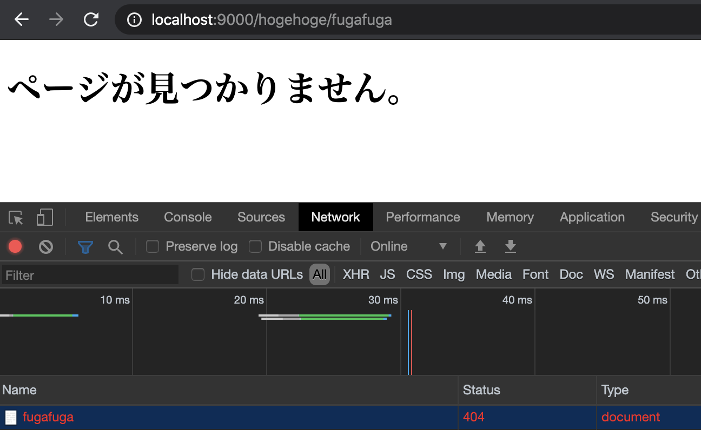
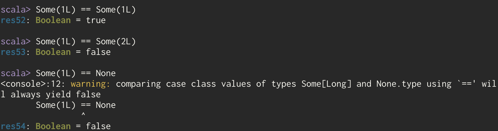
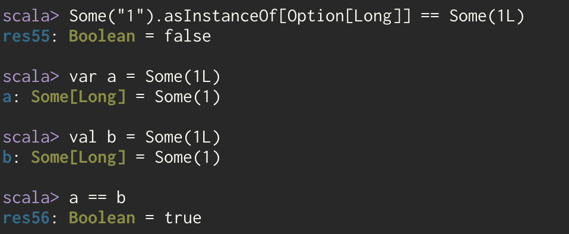
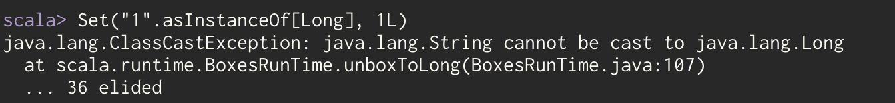
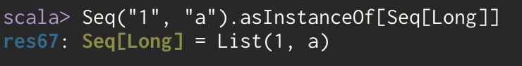

## おまけ

### CustomErrorHandlerの作成

システム開発ではよくエラーハンドラーを作成したくなることがあるので、作成の仕方を記載します。  
公式サイトに記載されている内容とほとんど同じではありますが、もう少し知りたい方は[こちら](https://www.playframework.com/documentation/2.8.x/ScalaErrorHandling)を確認ください。  

#### CustomErrorHandlerクラスの作成

さっそく今回利用する`CustomErrorHandler`クラスを作成していきます。  
今回のサンプルではPlayがデフォルトで表示する404ページを、以前のセクションで作成した404ページに差し替えてみます。  

```scala
package http

import javax.inject._
import play.api.http.DefaultHttpErrorHandler
import play.api._
import play.api.mvc._
import play.api.mvc.Results._
import play.api.routing.Router
import scala.concurrent._

@Singleton
class CustomErrorHandler @Inject() (
  env:          Environment,
  config:       Configuration,
  sourceMapper: OptionalSourceMapper,
  router:       Provider[Router]
) extends DefaultHttpErrorHandler(env, config, sourceMapper, router) {

  override def onNotFound(request: RequestHeader, message: String): Future[Result] = {
    Future.successful(
      NotFound(views.html.error.page404())
    )
  }
}
```

基本的な処理は継承元の`DefaultHttpErrorHandler`に移譲できるので、非常にシンプルですね。  
今回は404ページを差し替えたいので`onNotFound`を`override`しています。  

ちなみにですが`DefaultHttpErrorHandler`での実装はこのようになっています。  
```scala
protected def onNotFound(request: RequestHeader, message: String): Future[Result] = {
    Future.successful {
      if (config.showDevErrors) {
        NotFound(views.html.defaultpages.devNotFound(request.method, request.uri, router)(request))
      } else {
        NotFound(views.html.defaultpages.notFound(request.method, request.uri)(request))
      }
    }
  }
```

こちらは環境設定により、エラー画面を出し分けているようですね。  
開発を行う際にこちらの方が都合が良いようでしたら、この実装を参考にしてください。  


他にも`onClientError`, `onServerError`, `onForbidden`, `onBadRequest`などが存在しますが、同じように`override`が可能です。  
詳しくは`play.api.http`パッケージの`HttpErrorHandler.scala`あたりをみてみましょう。  

Playがそれらのイベントを良い感じに呼び出してくれるので、対応するメソッドを上書きしてあげれば良いです。  


#### 利用するエラーハンドラをPlayに設定

クラスが作成できたらPlayにこのクラスを利用することを伝えてあげましょう。  
Playではエラーハンドラを指定する方法が2つあります。

1. プロジェクトrootにErrorHandler.scalaを配置する
2. application.confに設定する

今回は汎用性の高い2の方法で対応してみたいと思います。  

`conf/application.conf`
```
play.http.errorHandler = "http.CustomErrorHandler"
```

これで設定は完了です。  
それでは動作をみてみましょう。  
[http://localhost:9000/hogehoge/fugafuga](http://localhost:9000/hogehoge/fugafuga)

アクセして以下の画面になっていれば実装完了です。  



### Option[String]のキャスト事故

資料を作成する中でハマったOptionの不思議な動きを紹介します。  
この動きは削除機能を作るときにOption同士を比較しようとして、ハマってしまいました。  



まず同じ型のOption同士を比較してみました。  
これはどうやら動くということが確認できている状態です。  



asInstnaceOfで変換をかけてみた状態です。  
比較が一致しなくなってしまったので、REPL上では同じ値は参照も同一になってしまってたまたま一致しているのでは？  と思い、valとvarで宣言をしたものを比較してみています。  
しかしこの場合には答えが一致してしまいました。  


ならば回りくどいがSetで排除してやろうと思い、Setに入れたところSetに1が二つ格納できてしまいました。  
これは本格的によくわからない、という状態です。  


そしてこれがSeqにして値を取り出してみたものです。  
データを取得するときに型の不一致でエラーになりました。  
どうやら見た目上はLongっぽく振る舞われているのですが、実体はStringのまま変更されていないようでした。  



ただ、本来はstringをasInstanceOfでLongに変換することはできないようです。  
数字以外も入るので、当然といえば当然ですね。  
これがOptionでラップされることで、処理自体は通るようになってしまうという挙動みたいです。  




Optionに限らずジェネリクスを利用しているものはできてしまうのかもしれませんね。  

どうやらasInstanceOfは実際に値を変換するというものではなくて、システム上指定した型として扱うということを宣言するものに近いみたいです。  
それがジェネリクスのように型を被せてしまうと内側まで検証できずに、コンパイルでは通ってしまうようです。  

事実、データ取得時には型の不一致でエラーになることから値の変換まではできていないですからね。  
あまりこのようなことはしないと思いますが、皆さんもお気をつけください。  

