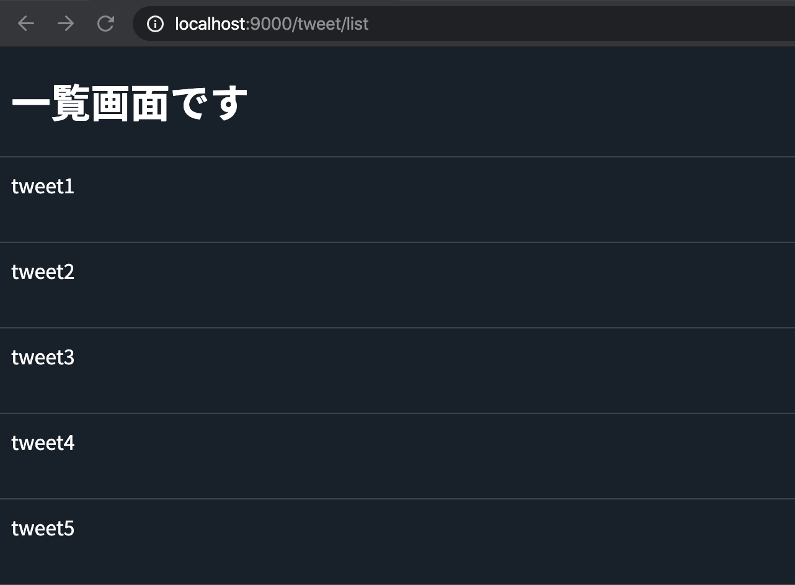

## 一覧表示画面の修正

この章ではArrayで実装されていたCRUDをDBを利用した形に修正していきます。  
まず一覧画面から修正していきます。  
ここでは前章で作成したRepositoryを利用して一覧画面が表示できるようにしていきます。  

### Repositoryの説明

前章でRepositoryを作成しましたが、DBからデータを取得する`all()`メソッドがさらっと追加されていました。  
ここでは改めて`all()`メソッドについて説明していきます。  

以下が今回対象のコードです。  

`app/slick/repositories/TweetRepository.scala`
```scala
// ...省略
private val query = new TableQuery(tag => new TweetTable(tag))

// ########## [DBIO Methods] ##########

/**
  * tweetを全件取得
  */
def all(): Future[Seq[Tweet]] = db.run(query.result)
```

slickでは`TableQuery`のインスタンスを利用してTableへアクセスを行います。  
細かい内部の動きは割愛しますが`TweetTable`のインスタンスを渡して作成されているため、Tweetテーブルに対しての処理が行えるようになっているわけですね。  
インスタンス作成を行っているのが以下です。  

```scala
private val query = new TableQuery(tag => new TweetTable(tag))
```

そしてここで生成されたインスタンスを利用して、実際に問合せを行うための処理が以下の`all()`メソッドです。  

```scala
def all(): Future[Seq[Tweet]] = db.run(query.result)
```

`query.result`の部分がQueryを組み立てている場所になります。  
今回は何もせずにテーブルのデータを全件取得しているというQueryになっています。  

これだとわかりづらいので、他にもサンプルの実装を紹介してみます。  

```scala
// idが偶数のものだけ抽出
def allOdd(): Future[Seq[Tweet]] = db.run(
  query.filter(x => x.id % 2L === 0L).result
)

// idが一致するものを取得
def findById(id: Long): Future[Seq[Tweet]] = db.run(
  query.filter(x => x.id  === id).result
)
```

TableQueryのインスタンスであるquery変数を起点にデータを絞り込んでいるのがわかりますね。  

最後に`db.run`の部分を説明します。  

`query.result`はまだQueryを組み立てだけの状態なので、これだけでは実際にDBへの問い合わせは行われません。  
実際にDBへの処理が行われるのは`db.run`が実行されたタイミングです。  

ここがplay-slickの場合には`HasDatabaseConfigProvider`に隠れている部分でもあります。  
このdbインスタンスは通常自分で作るのですが、play-slickの場合は上記のtraitの中で用意されています。  
通常は以下のように、自分で生成して利用します。  
```scala
val db = Database.forConfig("your_db_setting")
```

これで`def all()`の準備と理解ができました。  
次はControllerからこれを呼び出して、一覧で表示できるようにしていきます。  

### Controllerの修正

Repositoryにデータ取得処理を追加できたので、それを呼び出すController側を修正していきます。  
Controllerクラスも行数が大きくなっているので、修正した部分だけコードを載せていきますね。  

`app/controllers/tweet/TweetController.scala`
```scala
import slick.models.Tweet
import slick.repositories.TweetRepository
import scala.concurrent.ExecutionContext

@Singleton
class TweetController @Inject()(
  val controllerComponents: ControllerComponents,
  tweetRepository:          TweetRepository // <= repositoryをDI
)(implicit ec: ExecutionContext)
extends BaseController
with I18nSupport {

// ... 省略 ...

  /**
    * Tweetを一覧表示
    *   Action.asyncとすることでreturnの型としてFuture[Result]を受け取れるように修正
    */
  def list() =  Action async { implicit request: Request[AnyContent] =>
    // DBから値を取得してreturnするように修正
    for {
      results <- tweetRepository.all()
    } yield {
      Ok(views.html.tweet.list(results))
    }
  }

// ... 省略 ...

}
```

修正箇所についてはコメントで補足していますが、改めて一つ一つ説明をしていきます。  
まずはクラス宣言の部分です。  

```scala
@Singleton
class TweetController @Inject()(
  val controllerComponents: ControllerComponents,
  tweetRepository:          TweetRepository // <= repositoryをDI
)(implicit ec: ExecutionContext)
```

ここではInjectの対象にRepositoryを追加しています。  
こうすることで実行時に`tweetRepository`にインスタンスを注入してくれるようになります。  

またRepositoryから受け取ったFutureを処理する必要があるので`(implicit ec: ExecutionContext)`を追加して、Futureに渡せるようにしています。  

次にlistアクションの処理をみてみます。  

```scala
def list() =  Action async { implicit request: Request[AnyContent] =>
  // DBから値を取得してreturnするように修正
  for {
    results <- tweetRepository.all()
  } yield {
    Ok(views.html.tweet.list(results))
  }
}
```

修正しているのは2ヶ所あり、一つが`Action async`の部分。  
もう一つが残りのfor式の部分ですね。  

for部分は慣れていないとわかりづらいかもしれませんね。  
scalaのfor式はmap/flatMapの糖衣構文になっており、今回のようにforブロックの`<-`部分が1段の展開の場合には以下のコードと同じになります。  

```scala
tweetRepository.all().map(results =>
  Ok(views.html.tweet.list(results))
)
```

例えばこれが以下のように2段になると、map/flatMap展開になります。  
一段目がflatMapで、二段目がmapになっていますね。  

```scala
for {
  v1 <- tweetRepository.all()
  v2 <- tweetRepository.all()
} yield (v1, v2)

/**
上記の処理は以下と同義となります。  
tweetRepository.all().flatMap { v1 =>
  tweetRepository.all().map { v2 =>
    (v1, v2)
  }
}
*/
```

今回tweetRepositoryのreturnがFuture型になるので、for式のreturnがFuture[Result]型になっています。  
PlayではActionメソッドはreturnにResult型を要求しますが、これに対して`Action async`としてあげることでreturnの型要求をFuture[Result]にすることができます。  
そのため型を合わせるためにasyncのメソッドコールが追加されているのです。  

修正内容は比較的シンプルですね。  
利用しているモデルは変わっていないのでview側の修正は不要です。  

ここまで修正が終わったら、サーバを起動して動作を確認してみましょう。  
[http://localhost:9000/tweet/list](http://localhost:9000/tweet/list)  

以下のように５件のデータが表示できていればOKです。  



#### [補足] ActionとAction asyncの違い

実装は完了していますが、少しActionについて補足します。  

先ほどの説明を見ると「Actionは同期処理でAction asyncは非同期処理なんだ」と思うかもしれません。  
しかし実際にはActionとAction asyncに差はありません。  

これは[公式ドキュメント](https://www.playframework.com/documentation/2.8.x/ScalaAsync#Actions-are-asynchronous-by-default)にもNoteとして記載されています。  

```
Note: Both Action.apply and Action.async create Action objects that are handled internally in the same way.
There is a single kind of Action, which is asynchronous, and not two kinds (a synchronous one and an asynchronous one).
The .async builder is just a facility to simplify creating actions based on APIs that return a Future, which makes it easier to write non-blocking code.
```

意訳すると「どっちも同じで2種類あるわけではないよ」と書いてあります。  
言葉だけだと信じがたいので、実際にコードも見てみましょう。  

playのActionのapplyメソッドを確認してみると以下のようになっています。  

```scala
/**
 * Constructs an `Action` with default content.
 *
 * For example:
 * {{{
 * val echo = Action { request =>
 *   Ok("Got request [" + request + "]")
 * }
 * }}}
 *
 * @param block the action code
 * @return an action
 */
final def apply(block: R[B] => Result): Action[B] = async(block.andThen(Future.successful))
```

Actionの処理として書いていたblockをFutureに包んでasyncへ渡していますね。  
つまりどのように書いても結局asyncに渡されていくということです。  

Action, Action asyncはbody内の処理がreturnする型が書きやすい方を使えばいいわけですね。  
このあたりが最初は慣れませんが、通常はDBや外部APIコールをすることが多いのでだいたいasyncに落ち着きますよ。  

## 詳細画面の修正

一覧画面ができたので、続いて詳細画面の修正を行っていきます。  

### Repositoryの修正

詳細ページを表示するために、対象データを1件取得する処理をRepositoryに追加していきましょう。

`app/slick/repositories/TweetRepository.scala`
```scala
/**
 * idを指定してTweetを取得
 */
def findById(id: Long): Future[Option[Tweet]] = db.run(
  query.filter(x => x.id  === id).result.headOption
)
```

sampleで作成していた処理と似ていますが、今回は主キーであるidでデータを取得するためOption型でデータを取得しています。  
filterはSQLでいうところの `where` にあたります。  
単純にfilterを行うとデータがSeqとなるため、headOptionでOptionとして取得しています。  

慣れてしまうとScalaでmutableのArrayを扱うよりも、こちらの方が余程単純です。  

ちなみに基本的なクエリについては以下のページに説明がありますので、今後の参考にしてください。  
[Slick Queries](https://scala-slick.org/doc/3.3.1/queries.html)

### Controllerの修正

一覧機能の修正を参考に、こちらも処理を修正していきましょう。  

`app/controllers/tweet/TweetController.scala`
```scala
  /**
    * 対象IDのTweet詳細を表示
    */
  def show(id: Long) = Action async { implicit request: Request[AnyContent] =>
    // idが存在して、値が一致する場合にfindが成立
    for {
      tweetOpt <- tweetRepository.findById(id)
    } yield {
      tweetOpt match {
        case Some(tweet) => Ok(views.html.tweet.show(tweet))
        case None        => NotFound(views.html.error.page404())
      }
    }
  }
```

今回もActionを`async`にして、for式でFutureを処理しています。  
単純な処理であればこの形式で処理できてしまうので見やすくなりますね。  

前回に引き続きViewに渡すモデルは変わっていないので、全体の修正は以上です。

早速詳細ページを表示して動作を確認してみましょう。  
[http://localhost:9000/tweet/1](http://localhost:9000/tweet/1)  

正常に画面が表示されればOKです。  

## 更新画面の修正

詳細ページが表示できたので、引き続き更新画面の修正を行っていきます。  

### Repositoryの修正

今回は2つほどRepository実装のサンプルを作成してみました。  
以下に実装を記載します。  

`app/slick/repositories/TweetRepository.scala`
```scala
/**
 * 対象のtweetを更新する
 */
def update(tweet: Tweet): Future[Option[Tweet]] = db.run {
  val row = query.filter(_.id === tweet.id)
  for {
    old <- row.result.headOption
    _    = old match {
      case Some(_) => row.update(tweet)
      case None    => DBIO.successful(0)
    }
  } yield old
}

/**
 * 対象のTweetの内容を更新する
 */
def updateContent(id: Long, content: String): Future[Int] = {
  db.run(
    query.filter(_.id === id).map(_.content).update(content)
  )
}
```

`update`メソッドがモデル全体の更新で`updateContent`メソッドはcontentのみの変更です。  
意図的に違う書き方をしていますが、updateの方も以下のように書くことが可能です。  

```scala
def update(tweet: Tweet): Future[Int] = db.run(
  query.filter(_.id === tweet.id).update(tweet)
)
```

こちらの方がシンプルですね。  

元の`update`メソッドでは古いデータをreturnするために、やや回りくどい実装になっています。  
通常は引数として古いデータが渡されているので意図的にreturnする必要はないのですが、一つのメソッドの中でいくつかの処理を連続するサンプルとして記載してみました。  

ちなみにDBIO.successfulを利用すると正常系として引数に渡したデータをreturnできます。  
何かの拍子に利用したくなることもあると思いますので、SlickにもFuture.successfulみたいなものがあるんだな、程度に頭の中に残しておいていただけると良いと思います。  

### Controllerの修正

Repositoryの準備ができたので、次はControllerを修正していきます。  
変更画面を修正するために、今回は`edit`と`update`の2つのアクションを修正します。  

まず最初に`edit`アクション。  

```scala
/**
  * 編集画面を開く
  */
def edit(id: Long) = Action async { implicit request: Request[AnyContent] =>
  for {
    tweetOpt <- tweetRepository.findById(id)
 } yield {
   tweetOpt match {
     case Some(tweet) =>
       Ok(views.html.tweet.edit(
         // データを識別するためのidを渡す
         id,
         // fillでformに値を詰める
         form.fill(TweetFormData(tweet.content))
       ))
     case None        =>
       NotFound(views.html.error.page404())
   }
 }
}
```

基本的な修正は今まで同様で、まずは`Action`を`Action async`に修正しています。  
また今までtweetsのArrayからデータをfindしていたものをslickの`findById`から取得するように変更しています。  

編集画面の表示はこれで完了ですね。  
続いて、実際の更新処理である`update`を修正していきましょう。  

```scala
import scala.concurrent.Future
// ... 省略 ...

/**
  * 対象のツイートを更新する
  */
def update(id: Long) = Action async { implicit request: Request[AnyContent] =>
  form.bindFromRequest().fold(
    (formWithErrors: Form[TweetFormData]) => {
      Future.successful(BadRequest(views.html.tweet.edit(id, formWithErrors)))
    },
    (data: TweetFormData) => {
      for {
        count <- tweetRepository.updateContent(id, data.content)
      } yield {
        count match {
          case 0 => NotFound(views.html.error.page404())
          case _ => Redirect(routes.TweetController.list())
        }
      }
    }
    )
}
```

こちらもFutureを受け取れるようにするため`Action async`にしてFuture[Result]に対応しています。  
他にはデータ更新の処理をslickを利用したものに修正していますね。  
以下の部分が該当する箇所です。  

```scala
for {
  count <- tweetRepository.updateContent(id, data.content)
} yield {
  count match {
    case 0 => NotFound(views.html.error.page404())
    case _ => Redirect(routes.TweetController.list())
  }
}
```

update処理は更新されたデータ数をIntで返すため`case 0`とそれ以外で処理を分けています。  
データ更新が0件というのは、不正なデータが対象に取られている状態なので404としています。  
正常系は今までと同様ですね。  

またもう一つ以下も修正しています。  

```scala
Future.successful(BadRequest(views.html.tweet.edit(id, formWithErrors)))
```

こちらはformにエラーがあった場合のreturnですね。  
`Action async`になった影響で、こちらのResultをFutureで囲ってあげる必要があります。  
そのために正常に成功したFuture型として、何もしないFutureをつくる`Future.successful`で処理をしています。  
これでreturnの型が`Future[Result]`になります。  

例によってviewの修正は不要なため、これで修正は完了です。  
以下にアクセスして動作を確認してみてください。  
[http://localhost:9000/tweet/1/edit](http://localhost:9000/tweet/1/edit)  

## 登録画面の修正

一覧からの流れの修正が完了したので、次は登録画面を修正していきます。  

### Repositoryの修正

slickでの登録機能を実装していきます。  

`app/slick/repositories/TweetRepository.scala`
```scala
/**
 * tweetを1件登録する
 */
def insert(tweet: Tweet): Future[Long]= db.run(
  // returningメソッドを利用することで、このメソッドに指定したデータを登録結果として返却するようにできる
  (query returning query.map(_.id)) += tweet
)
```

登録処理の部分で見慣れないメソッドが出てきています。  
実は登録処理は以下のように書くこともできるんです。  

```scala
/**
 * tweetを1件登録する
 */
def insert(tweet: Tweet): Future[Int]= db.run(
  query += tweet
)
```

こちらの方が見た目はシンプルです。  
では、この二つの何が違うと言うと、それは最終的に返される結果の値です。  

最初のプログラムに書いてある`returning`メソッドを利用すると、登録されたデータの一部を返却することができます。  
登録処理ではidはDBのAutoInc設定がされるため、登録時にはidが未確定です。  
登録後にそのidを利用して関連テーブルにデータを登録するケースなどを考えると、実際に登録されたidが欲しくなりますよね。  
そのため`query.map(_.id)`という形でidを返却するように`returning`に指定しているのです。

スペースで区切られていると、そういう文法のように見えてしまいますが、実際には以下のようなメソッド呼び出しになっています。  

```scala
  (query.returning(query.map(_.id))).+=(tweet)
```

`query.map(_.id)`の部分はreturningの引数になっているんですね。  
これにより、登録を行いつつ登録されたidを呼び出し側で受け取れるようになりました。  

またTableの型は、以下のようにOptionではないLong型になっています。  

```scala
val id: Rep[Long] = column[Long]("id", O.AutoInc, O.PrimaryKey)
```

今回のTweetモデルのidはOption[Long]なのですが、column定義に`O.AutoInc`が設定されていることにより、登録時にidの値が無視されるようになっています。  
これによりtweetモデルをそのまま登録処理に渡すことが可能です。  

この説明は[ここ](http://scala-slick.org/doc/3.3.1/queries.html#inserting)に記載されていますが、以下に説明文を抜粋します。  

```
When you include an AutoInc column in an insert operation, it is silently ignored, so that the database can generate the proper value.
In this case you usually want to get back the auto-generated primary key column.
By default, += gives you a count of the number of affected rows (which will usually be 1) and ++= gives you an accumulated count in an Option (which can be None if the database system does not provide counts for all rows).
This can be changed with the returning method where you specify the columns to be returned (as a single value or tuple from += and a Seq of such values from ++=):
```

Repositoryの実装と説明は以上になります。  

### Controllerの修正

引き続きコントローラの修正を行います。  
更新処理と同じように、今回は`register`と`store`アクションをみていきましょう。  

まずは`register`アクションです。  

`app/controllers/tweet/TweetController.scala`
```scala
/**
  * 登録画面の表示用
  */
def register() = Action { implicit request: Request[AnyContent] =>
  Ok(views.html.tweet.store(form))
}
```

こちらは修正前のままの状態なのですが、特に修正は必要なさそうですね。  
登録画面は画面上に必要なデータがないため、今回の修正の影響は受けていませんでした。  

では、次は実際の登録処理である`store`です。  

`app/controllers/tweet/TweetController.scala`
```scala
/**
 * 登録処理実を行う
 */
def store() = Action async { implicit request: Request[AnyContent] =>
  // foldでデータ受け取りの成功、失敗を分岐しつつ処理が行える
  form.bindFromRequest().fold(
    // 処理が失敗した場合に呼び出される関数
    (formWithErrors: Form[TweetFormData]) => {
      Future.successful(BadRequest(views.html.tweet.store(formWithErrors)))
    },
    // 処理が成功した場合に呼び出される関数
    (tweetFormData: TweetFormData) => {
      for {
        // データを登録。returnのidは不要なので捨てる
        _ <- tweetRepository.insert(Tweet(None, tweetFormData.content))
      } yield {
        Redirect(routes.TweetController.list())
      }
    }
  )
}
```

登録処理の修正は基本的に更新処理と同様です。  
`Action`を`Action async`として失敗時、成功時共にFutureで処理をしています。  
登録処理もRepositoryの処理を呼び出してデータを渡していますね。  

returningの説明をした後ではありますが、今回は返却されるidの値は利用しないので`_`に捨てています。  

更新処理で一度行っているので、単純ではありますが修正ができたら動作をみてみましょう。  
[http://localhost:9000/tweet/store](http://localhost:9000/tweet/store)  

画面表示と登録処理まで確認できたら完了です！

## 削除処理の修正

最後は削除処理の修正です。  
これでCRUDの最後の一つですね。  

### Repositoryの修正

例によってRepositoryを修正していきます。  

`app/slick/repositories/TweetRepository.scala`
```scala
/**
 * 対象のデータを削除する
 */
def delete(id: Long): Future[Int] = delete(Some(id))

/**
 * 対象のデータを削除する
 */
def delete(idOpt: Option[Long]) = db.run(
  query.filter(_.id === idOpt).delete
)
```

こちらが削除処理の実装になります。  
実装自体は変更処理と似ていますね。  
`delete`もreturnはIntになっていて、削除された件数が返されます。  

ただ今回はoverloadしたメソッドも用意してみました。  
この処理では主キーを利用してデータをfilterしているため、Option[Long]に対してfilterがかけられます。  
それを利用してOption[Long]を受け取る`delete`メソッドをメインにしつつ、Longを直接受け取る`delete`メソッドも定義しています。  

このようなことをしなくても呼び出す側で以下のように実装することもできます。  
```scala
idOpt.map(tweetRepository.delete)
```

ただ、せっかくLong, Option[Long]のどちらも扱えるのでそのまま渡せるようにしちゃいました。  
少し脱線しましたが、delete処理については以上です。  

### Controllerの修正

作成した`delete`メソッドを利用してデータを削除できるようにしていきます。  

```scala
/**
 * 対象のデータを削除する
 */
def delete() = Action async { implicit request: Request[AnyContent] =>
  // requestから直接値を取得するサンプル
  val idOpt = request.body.asFormUrlEncoded.get("id").headOption
  for {
    // toLongしているが、stringからlongへparseできない場合があるため御行儀は悪い
    result <- tweetRepository.delete(idOpt.map(_.toLong)) 
  } yield {
    // 削除対象の有無によって処理を分岐
    result match {
      case 0 => NotFound(views.html.error.page404())
      case _ => Redirect(routes.TweetController.list())
    }
  }
}
```

今回はOption[Long]を渡せるようにしているので、このような処理になります。  
変更処理に似ていますね。  

urlから受けとったidはstringになっているため、mapでLong型に変換をかけています。  
本来は文字列がちゃんと数値に変換できるものなのか確認が必要ですが、これはurlからパラメータを取得する処理のサンプルとして記載してるので、その辺りのケアは割愛しています。  

さぁ、ここまで書けたら動作を確認してみましょう。  
[http://localhost:9000/tweet/list](http://localhost:9000/tweet/list)  

削除ボタンを押してデータが削除できていればOKです。  

## まとめ

これで全ての処理をDBを利用した処理に修正することができました。  
slickは最初の設定が煩雑なため、独学で利用しようとすると難しく感じることが多いかもしれません。  

今はこのサンプルを利用してPlay-Slickでの開発に慣れていき、余裕が出てきたら一つ一つ読み解いていただければと思います。  


